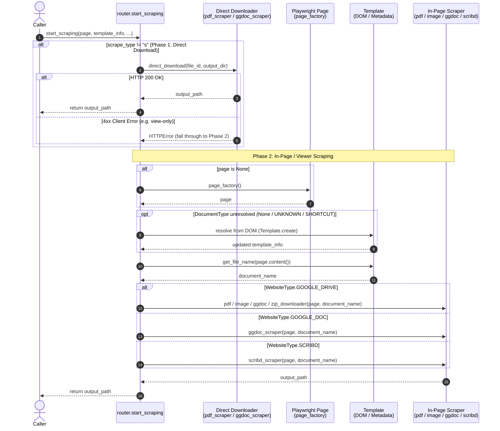

# Scraper Router Sequence Diagram

Simple sequence diagram for [`router.py`](file:///media/New%20Volume/projects/Python/Scraper/router.py) (`start_scraping`).

```mermaid
sequenceDiagram
    autonumber
    actor Caller
    participant Router as router.start_scraping
    participant Direct as Direct Downloader<br/>(pdf_scraper / ggdoc_scraper)
    participant Browser as Playwright Page<br/>(page_factory)
    participant Template as Template<br/>(DOM / Metadata)
    participant InPage as In-Page Scraper<br/>(pdf / image / ggdoc / scribd)

    Caller->>Router: start_scraping(page, template_info, ...)

    alt scrape_type != "s" (Phase 1: Direct Download)
        Router->>Direct: direct_download(file_id, output_dir)
        alt HTTP 200 OK
            Direct-->>Router: output_path
            Router-->>Caller: return output_path
        else 4xx Client Error (e.g. view-only)
            Direct-->>Router: HTTPError (fall through to Phase 2)
        end
    end

    Note over Router,InPage: Phase 2: In-Page / Viewer Scraping

    alt page is None
        Router->>Browser: page_factory()
        Browser-->>Router: page
    end

    opt DocumentType unresolved (None / UNKNOWN / SHORTCUT)
        Router->>Template: resolve from DOM (Template.create)
        Template-->>Router: updated template_info
    end

    Router->>Template: get_file_name(page.content())
    Template-->>Router: document_name

    alt WebsiteType.GOOGLE_DRIVE
        Router->>InPage: pdf / image / ggdoc / zip_downloader(page, document_name)
    else WebsiteType.GOOGLE_DOC
        Router->>InPage: ggdoc_scraper(page, document_name)
    else WebsiteType.SCRIBD
        Router->>InPage: scribd_scraper(page, document_name)
    end

    InPage-->>Router: output_path
    Router-->>Caller: return output_path
```
